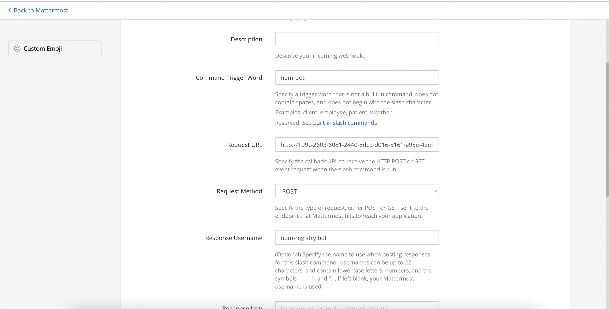
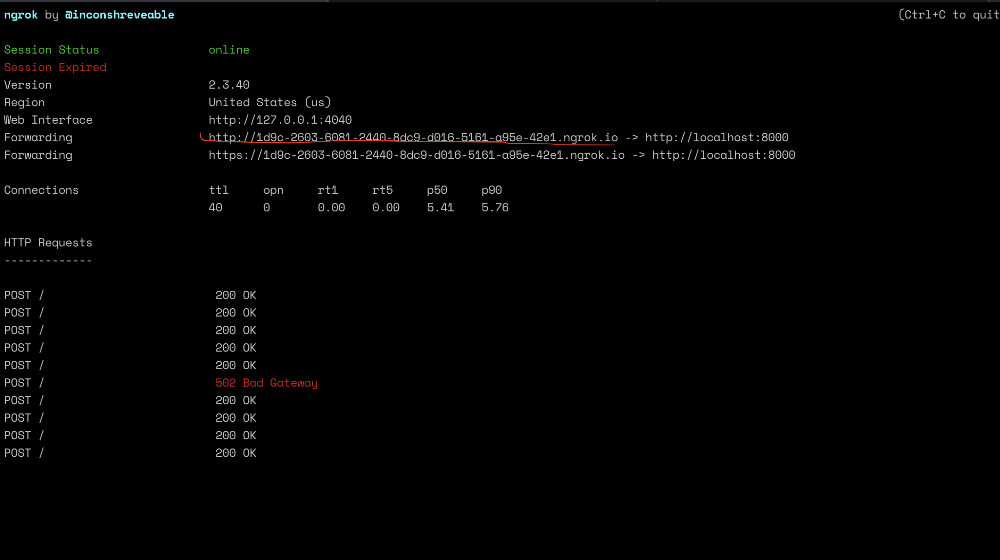
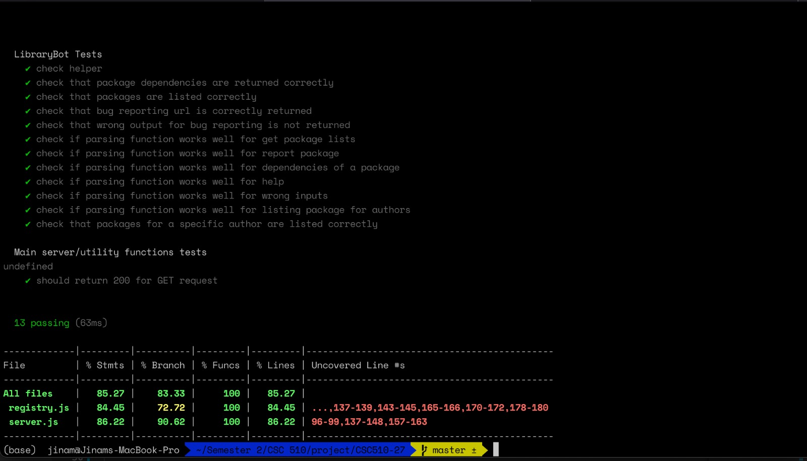

## Bot

### Bot Implementation

- To get list of packages with keyword ```\npm-bot list packages for @keyword```
- To get list of packages of the author ```\npm-bot list packages by @authorname```
- To raise an issue for a particular package  ```\npm-bot report issue for @package```
- To get the list of dependencies and devDependencies for a particular package  ```\npm-bot dependencies for @package```


## Bot platform

The NPM registry bot is integrated on the Mattermost server [(link)](https://chat.robotcodelab.com/csc510-s22) and can be run from any channel/direct message. For our purposes, we created a new public channel where we've tested out the bot [(link)](https://chat.robotcodelab.com/csc510-s22/channels/csc510-27).

The bot can run from any channel because it is implemented as a "slash command" and works using webhooks. Hence, the bot is not listening to a particular channel and cannot be accidently triggered.

## Bot integration

The end product of the bot will work at all times because it will be hosted using an AWS Lambda function and it will have a public endpoint that can be used in the slash command request URL (as shown in image below). Currently, it works when a machine is given a public endpoint using `ngrok` (command: `brew install ngrok`).


### Steps to run using a local mac machine

Note: this implementation has not been tested using windows machines. But the basic idea is to get a public endpoint that points to a particular port on your local machine.

1. Install ngrok (`brew install ngrok`)
2. Go to the code repository and run `node server.js`. This will start the server on port 8000. The server will listen to POST and GET requests.
   1. GET request can be used to get the status of the service/bot.
   2. POST request accepts data from the mattermost channel. Currently, the bot will fail incase the data is not sent in the format as specified in the mattermost documentation.
3. In a seperate terminal, run `/opt/homebrew/bin/ngrok http 8000`. This command will start ngrok service and generate a public URL that can be used in the request url part as shown in the above image [bot_request_url](images/bot_request_url.png).
   Sample output from executing the command:
   
4. Use the highlighted URL and paste in the Request URL section mentioned above.


### Use Case Refinement

- Updated UseCase 2, which gets the list of packages, also gets the list of packages with their accessing links

* Removed UseCase 3, which returns the documentation, as it is covered in the above usecase

Added new Use Cases

- UseCase 3 - gets the list of packages of a particular author

- UseCase 4 - gets the list of dependencies and devDependencies (if any) of a package

### Test Coverage



### Mocking Service Component

We have used the 'nock' package of npm to mock the services. 

Here's an example snippet from our tests

```
const packageDepMock = nock(rootUrl)
      .get("/package/react")
      .reply(200, packageDependencies);
```

Here, we mock the rooturl, which is ``"https://api.npms.io/v2"``, on a GET request (.get), and expect a return reply of packageDependencies, which is a mocked object, with a status code of 200. 

### Screencast

[Here's the link](https://drive.google.com/file/d/1gp6hGGo_BO08K25QEgtcX5p1c2vLWe5k/view?usp=sharing)
