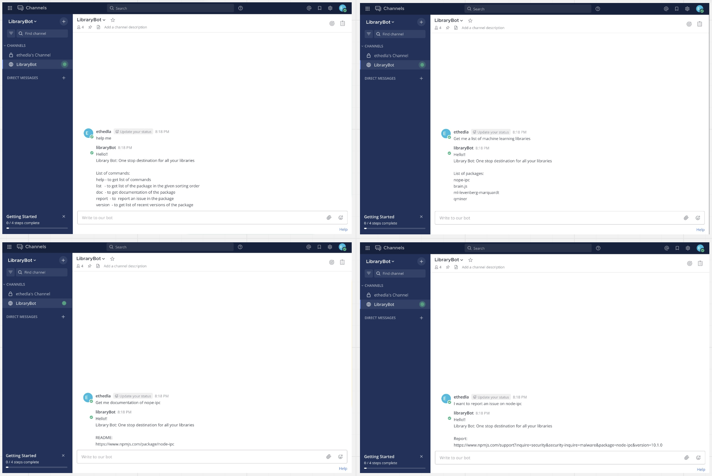
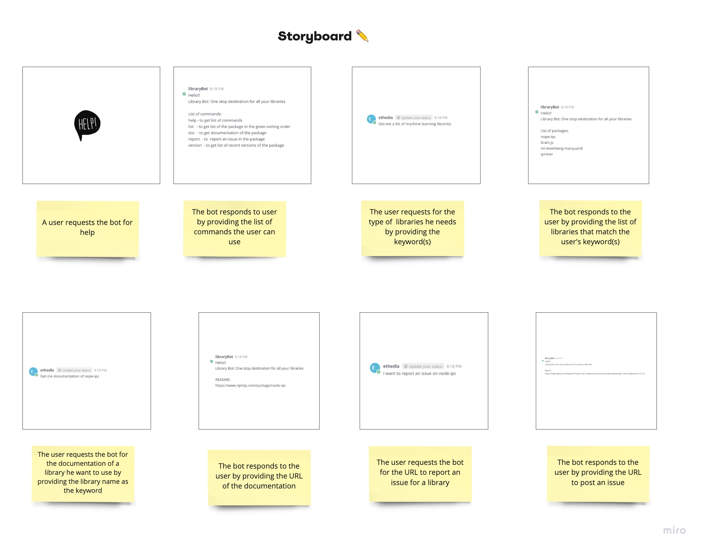

# Library Bot<br>One stop destination for NodeJS libraries

## Problem Statement

Consider a situation in which a naive user of NodeJS wants to start using some functionality for which they need some additional dependencies. Although the user knows what they need from that library, the user might not know the library name given the large pool of npm libraries available. Although we have powerful search engines like Google which can help a user find the library, the search engines can’t help the user by providing a list of all possible libraries that match the user’s criteria at a single place Also most of these search results are highly skewed based on popularity instead of accurately understanding the users’ needs. These search engines return many search results that could actually confuse the user. Besides, there could be cases where the search results provided by the search engine are deprecated and non functional any more. This is where our LibraryBot comes into play. It takes in the user’s input, finds the keywords from the user’s query, and tries to return the top working results.

## Bot Description

The library bot helps for a new NodeJS user to find any library he needs under one roof. The main purpose of this bot is to not only make the search process easier for a user, but also be flexible with what the user wants in terms of popularity, authors of the library, maintainers, and quality of the library. The LibraryBot is run on a serverless architecture on AWS Lambda, listens to the MatterMost chat server and returns a result based on the user's query. The bot tries to find the keywords from the user’s input given in the chat server, and based on the user's input it makes the respective REST API call provided by npm registry. The bot can help the user by providing a list of libraries that match the search criteria, helps users to get details of a particular library like the popularity and quality scores, names of the contributors, and also helps users to report an issue for any library he used. By default, the bot returns the results based on the search score of the library. The user has to provide additional keywords like popularity and quality to sort the search results based on the criteria. The library bot uses a Reactor pattern, as it just reacts to the messages provided by the user and doesn't remember anything that was said before

**An Example:**

When the user types "I need some machine learning libraries", the bot would response saying: <br>
"Here are some libraries that match "machine learning" <br>
   node-ipc <br>
   brain.js <br>
   annoy <br>


## Use cases

Keyword representation as input: /command

1. **List of commands**
    * Preconditions: User must be connected to the web and be present in the correct channel.
    * Main Flow: User will request for help [S1]. Bot will provide list of available commands [S2].
    * Subflows:
      * [S1] User provides ```\npm-bot helpme``` or help or bachao as command.
      * [S2] Bot will return list of commands that can be used
    * Alternative Flows:
      * [E1] If nothing, the bot will return list of commands that can be used by the bot.
      * [E2] If the input from user is a single word, returns list of packages with input as keyword.

2. **Get list of packages**
   * Preconditions: User must be connected to the web and be present in the correct channel.
   * Main Flow: User will request for list of packages with keyword by sorting options as optional[S1]. Bot will provide list of possible package that contains the requested keyword [S2].
   * Subflows:
     * [S1] User asks list of packages with ```\npm-bot list packages for @keyword``` command using @keyword for package.
     * [S2] Bot will return list of available packages with requested keyword with their respective accessing links.
   * Alternative Flows:
     * [E1] If the input from user is a single word, returns list of packages with input as keyword.
     * [E2] If the input from user is not single word, redirects to #1 use case.

3. **Get list of packages for an author**
   * Preconditions: User must be connected to the web and be present in the correct channel.
   * Main Flow: User will request the package of an author [S1]. Bot will provide possible documentation material of the requested packages of the author [S2].
   * Subflows:
     * [S1] User requests for the list of a packages with ```\npm-bot list packages by @authorname``` as command using @authorname for author.
     * [S2] Bot will return list of packages of the requested author with keyword.
   * Alternative Flows:
     * [E1] If the input from user is a single word, returns list of packages with input as author.
     * [E2] If the input from user is not single word, redirects to #1 use case.

4. **Get list of dependencies of a package**
   * Preconditions: User must be connected to the web and be present in the correct channel.
   * Main Flow: User will request the list of dependencies of a package [S1]. Bot will provide list of dependencies of the requested package [S2].
   * Subflows:
     * [S1] User requests for the list of dependencies with ```\npm-bot dependencies for @package``` as command using @package.
     * [S2] Bot will return list of dependencies and devDependencies of the requested package with keyword.
   * Alternative Flows:
     * [E1] If the input from user is a single word, returns list of dependencies with input as package.
     * [E2] If the input from user is not single word, redirects to #1 use case.

5. **Report an issue**
   * Preconditions: User must be connected to the web and be present in the correct channel.
   * Main Flow: User will request to report an issue for a package [S1]. Bot will provide information for reporting an issue for the package [S2].
   * Subflows:
     * [S1] User requests for reporting an issue with ```\npm-bot report issue for @package``` as command using @package.
     * [S2] Bot will return the information or steps to report an issue for the package.
   * Alternative Flows:
     * [E1] If the input from user is a single word, returns list of packages with input as keyword.
     * [E2] If the input from user is not single word, redirects to #1 use case.

5. **(Future Scope) Get list of versions**
   * Preconditions: User must be connected to the web and be present in the correct channel.
   * Main Flow: User will request for list of versions for a package with keyword [S1]. Bot will provide list of possible versions of the package that contains the requested keyword [S2].
   * Subflows:
     * [S1] User asks list of versions with /version or /versions command using @keyword for package.
     * [S2] Bot will return list of recent 10 versions package with requested keyword.
   * Alternative Flows:
     * [E1] If the input from user is a single word, returns list of packages with input as keyword.
     * [E2] If the input from user is not single word, redirects to #1 use case.


## Design Sketches

**Wireframe**



**Story Board**



## Architecture Design


The bot will be deployed using serverless architecture. The bot will be a MatterMost client that will monitor a MatterMost channel for events and based on the pattern of the events, will trigger a specific process.

>For example, when the user types "how to report an issue (or bug) for bre library", the bot would response saying: "You can report bugs/issues at https://github.com/mysticatea/bre/issues"


**Architecture components:**

1. NPM registry database: This is a couchDB database hosted by npm that keeps the metadata about the repositories registered with NPM. This database can be queried using API calls [(link)](https://registry.npmjs.org/).

2. AWS Lambda function (may change in the future): This where the core logic of the bot will lie. This lambda function would **hear** a Mattermost channel and be on the lookout for matching patterns and trigger processes accordingly. The reason behind using AWS Lambda is that it will minimize cost as it is triggered only when needed and we can have many parallel instances of the bot if many users trigger it.

3. CloudWatch Logs: AWS central service for managing logs. We will use cloudwatch insights along with this to keep track of the number of users for the bot and the number of errors.

4. Mattermost: The last component describes the Mattermost channel and the way that the user will interact with the bot.

The typical flow will be as follows:
The user would trigger the bot (lambda function) using a command (for example: /bot helpme) specified in the Mattermost channel.
</br>The lambda function will then parse the request, decide the API request to use according to the parsed request. The API call will inturn hit the npm registry database and the bot will receive the response. Here, there is a dependency on the status of the npm registry and how long it takes to respond to the bot's request.
</br> The response of the npm database API is then processed by the bot and the accurate information is sent back along to the user.

**Design Pattern description**

The bot will be a **Reactor** i.e. it will react to the events triggered by the user and will keep no memory of the user. The bot would not differ with the change in channels either.

We can also use the *Factory* design pattern as it helps to create different objects by exposing a simple API that return the specified object type. i.e, we can have a common interface that be used to refer the list_of_libraries/documentation/issue_report objects without exposing the creation logic of these objects.

An other pattern, *Chain of Responsibility*, can also be implemented for our bot, as we  can decouple the receiver of a request based on type of request i.e, (list_of_libraries/documentation/issue_report).
